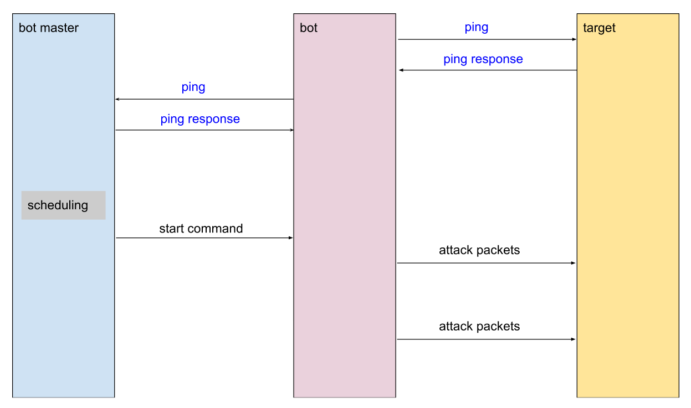
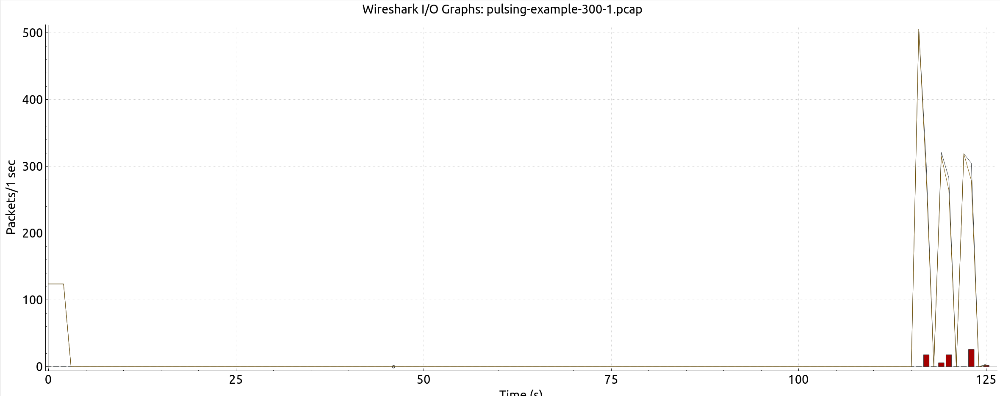
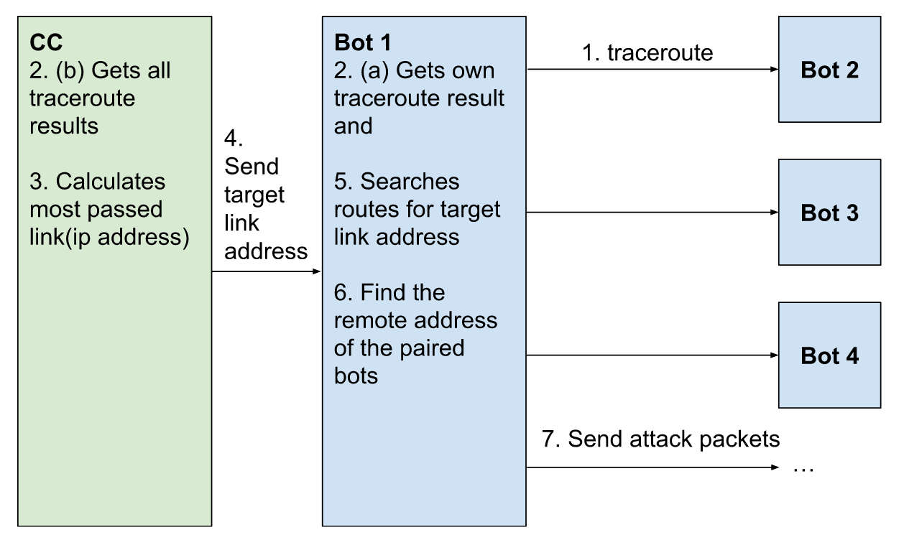
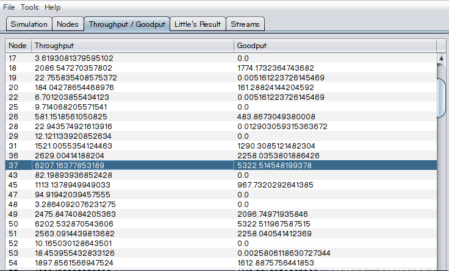
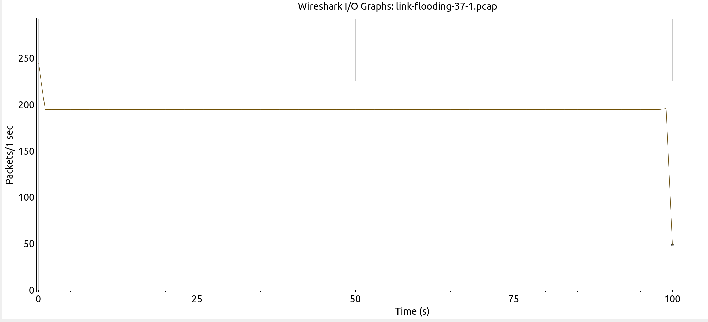

# Botnet Module

## Overview

-   [Description](#description)
-   [Design](#design)
    -   [Attacks](#attacks)
        -   [PulsingAttack](#pulsing-attack)
        -   [LinkFloodingAttack](#linkfloodingattack)
    -   [Benign Traffic](#benign-traffic)
-   [Limitations (Future Work)](#limitations-future-work)

## Description

The botnet module utilizes BRITE and ns-3 to efficiently create customizable topology and
attack applications for DDoS dataset generation. Applications include pulsing attack,
link flooding attack, and benign traffic generation.

## Design

By basing our module on BRITE, we first generate a BRITE topology as the basis for our
network. We assume that bots and benign users reside at the leaf nodes of our network.
and run our applications on the leaf nodes of the topology. Technically, the leaf nodes
are routers in the BRITE topology design, however, we view the leaf routers as the
aggregation of traffic generated by the benign nodes or bots that reside beyond the leaf
node in the local network. This is beneficial for simulations that require a lot of
nodes, since it decreases the number of actual nodes simulated in ns-3 and cuts back on
resources and simulation time.

There are some main components in the design: `Botnet`, `BotnetHelper`, and
different applications that can be installed onto the nodes, ex: `PulsingAttackBot`,
`PulsingAttackCC`, `LinkFloodingAttack`, `LinkFloodingAttackCC`,
`BenignApplication`. Usages of these components in coordination with existing ns-3
applications such as `V4Ping` and `V4TraceRoute` are shown in the `examples`
folder.

### Attacks

#### Pulsing Attack

The overall procedure of a simulated pulsing attack is shown in the figure below:

1.  Bots ping both the central controller(bot master) and the target node.

2.  The round-trip-time from the bot pings are collected through the RTT trace source in
    the existing `V4Ping` application.

3.  The central controller schedules the bots and sends each bot a packet to signal them
    to start sending attack packets

4.  On receival of the signal from the central controller, the bots start to send attack
    packets periodically.

[view example 1](../examples/pulsing-example.cc)
[view example 2](../examples/pulsing-example-2.cc)

Simulation Result:

The example attack produces a pulse width of around 2 seconds. Error packets can be observed at the traffic pulses. The pulse width can be controlled by adjusting the link bandwidth. The larger the link bandwidth, the smaller the pulse width. However, currently 2 seconds is the minimized result.

#### LinkFloodingAttack

The overall procedure of a simulated link flooding attack  is shown in the figure below:

1.  Each bot does pairwise traceroutes to all other bots

2.  By adding an additional trace source to the existing `V4TraceRoute` application, we
    are able to collect the route information and save it to both the bots and the central
    controller. The changed file is saved in `botnet/changes/v4traceroute.cc`.

3.  The central controller then calculates the most used link(based on the IPv4 address
    of the node), and sends the target link address to all the bots.

4.  The bots search through their traceroute information to find the corresponding routes
    that pass through that node and set the remote to those paired bot addresses.

5.  They start sending attack packets to the paired bot addresses to flood the targeted
    link.

[view example](../examples/link-flooding-example.cc)

Simulation Result:

Analyze **link-flooding.tr** with tracemetrics, we can see that the critical link has the most traffic throughput among all nodes, however, it is not enough to cause packet drops in the example. This may be because there are not enough bots using the critical node.

The packet trace obtained at the critical link, the time in the packet trace file starts later since the trace callback is set after the start of the simulation:

### Benign Traffic

Users are able to simulate benign background traffic that follows a certain
random distribution. Current research usually add real world benign traffic directly on
top of generated malicious traffic, making it difficult to estimate the impacts on
benign traffic caused by the malicious traffic.

Since data volume generally conforms to lognormal traffic, it is recommended that the
DataRate is set to the LogNormalRandomVariable. However, users can choose from (1)
LogNormal (2) Normal (3) Constant (4) Uniform Random Variables to set the DataRate and
PacketSize variables in the benign traffic application.

[view example](../examples/benign-example.cc)

## Limitations (Future work)

Long term goal of this project is to be able to simulate realistic DDoS scenarios and
generate DDoS datasets for research purposes. Currently, this module supports the
generation of pulsing DDoS attacks. Some possible future directions are:

-   Imitate
    existing botnet family behavior. Some botnet families follow specific behaviors, ex. use
    specific protocols. This could make the dataset more realistic.

-   Add additional flow
    monitoring information. Allowing users to extract flow information for further analysis.

-   Add custom packet tags specifically designed for DDoS detection, ex. malicious
    packets/benign packets.

-   Import more topology datasets to ns3
